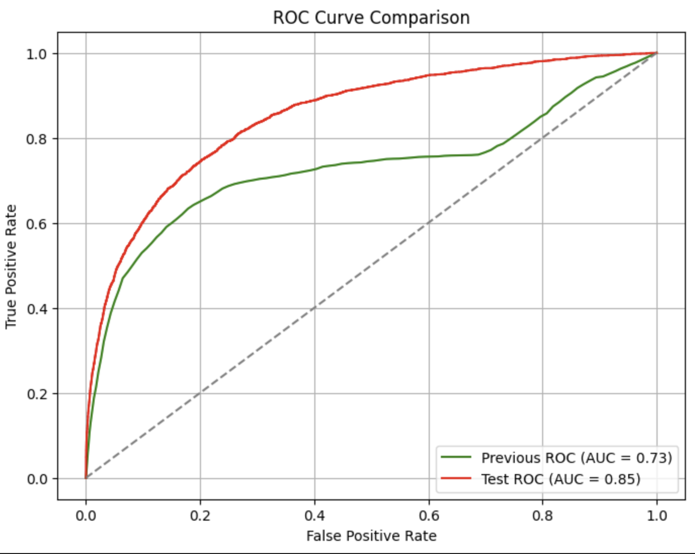

# Fraud Detection Project

An end-to-end machine learning pipeline for fraud detection in an online marketplace. The repository covers data ingestion, cleaning, feature engineering, model training, hyperparameter tuning, evaluation, and deployment, structured in a clean, maintainable, and reproducible way structured according to the [Cookiecutter Data Science](https://drivendata.github.io/cookiecutter-data-science/) template.

The business answers are available in portuguese at the end of the following notebook: `05_model_evaluation.ipynb` and bellow

## Respostas

1) Desenvolva um modelo para predizer a variável Fraude (1-Sim, 0-Não).
Quais técnicas testou? Qual selecionou como melhor abordagem? Explique!

* Este desenvolvimento foi iniciado com uma base forte na EDA, isso para garantir estabilidade do modelo e que não perca performance rapidamente em produção
* O modelo escolhido para treinamento foi LightGBM por 3 motivos, o primeiro, que ele é um modelo de boosting, comprovadamente eficaz para casos de target desbalanceada. Já o segundo motivo está relacionado a sua natureza baseada em arvores que facilita no uso de variáveis dentro dele (por isso não foram feitos tratamentos muito rebuscados como normalizar e padronizar as variáveis como é necessário para uma regressão logistica por exemplo). E por último, velocidade, o LightGBM é um modelo conhecido por ser rápido o que facilita muito na hora de treina-lo e também na hora de usa-lo.
* Para seleção de features (além da manual por EDA), foram utilizados modelos bem tradcionais como o Recursive Feature Eliminator e o Boruta, ambos utilizando de um modelo de arvore simples (Random Forest) como base.
* Para tuning foi utilizado o Optuna, ele facilita "tunar" o modelo de maneira mais inteligente e de forma paralela o que o torna muito eficiente.

2) Compare o desempenho do seu algoritmo com o desempenho de um modelo
anterior, cujo resultado é encontrado na coluna Score do dataset. Quais
métricas usou e qual sua conclusão?




Nas figuras acima, utilizamos duas principais métricas para comparar nosso modelo com o anterior:

* ROC AUC (Area Under the ROC Curve): Mede a capacidade de distinguir transações fraudulentas das legítimas em diferentes pontos de corte. Nosso modelo (AUC=0.85) superou o modelo anterior (AUC=0.73).
* PR AUC (Area Under the Precision-Recall Curve): Essencial para cenários desbalanceados, pois mostra como o modelo equilibra a precisão e o recall. Novamente, nosso modelo (AUC=0.38) superou o anterior (AUC=0.26).

3) Como você pode garantir que o desempenho do modelo no laboratório vai
ser um proxy para o desempenho do modelo em produção?

* Divisão temporal (out-of-time split): Treinar em semanas passadas (ex.: 10–14) e testar em semanas futuras (ex.: 15–17) aproxima a realidade de produção.
* Na EDA foram feitas diversas análises para garantir que as variáveis se demonstram estáveis ao longo do tempo e se não, ou foram removidas, ou foram refatoradas para ficarem estáveis.

4) Supondo que o desempenho produtivo seja muito diferente do esperado,
quais você acha que são as causas mais prováveis?

* Drift de dados ou conceito: O comportamento das fraudes e dos clientes pode (e vai) mudar ao longo do tempo (ex.: variável com classes dos produtos ser redefinida pelas áreas de negócio e começarem a vir muitas classes diferentes do que foi visto no treino).
* Diferenças de pipeline e/ou problemas em prod: Se o pipeline de produção for diferente ou em algum momento passar a receber uma das variáveis de forma diferente do que foi passado para treino (ex.: variável com classes dos produtos começar a trazer as classes com uma nomenclatura diferente), o modelo pode performar pior.
* Sazonalidade: Eventos atípicos ou alterações bruscas no comportamento de compra, como grandes ataques de fraude por exemplo, podem impactar a performance.

5) Com a informação adicional de que uma fraude custa 10 vezes mais para a
empresa do que o bloqueio incorreto de um pagamento, o que você faria de
diferente?

* Ajuste no threshold: Passar a tolerar mais falsos positivos para reduzir falsos negativos, pois a perda com fraude é muito mais custosa, lembrando que pode gerar alto atrito com cliente e é ruim apra imagem da empresa.
* Treino com pesos: É possível ponderar as classes no treinamento conforme os prejuízos. Pode-se colocar exatamente este peso citado no treinamento para garantir que o modelo se adeque a esta necessidade.

6) Queremos encontrar o ponto de corte ideal para o modelo já treinado
apresentado na parte (Score, onde 0 (zero) é o risco mais baixo e 100 (cem) o
mais alto). Sabemos que MELI ganha 10% do valor de um pagamento
aprovado corretamente e a cada fraude aprovada perdemos 100% do valor do
pagamento.Dena o ponto de corte que maximize os lucros do MELI, de
forma que todos os pagamentos com menor Score sejam aprovados e os
maiores sejam rejeitados.


Ponto de corte que maximiza o lucro: 76
Lucro máximo estimado: 264929.07

7) Se o modelo precisar responder online, no menor tempo possível, o que isso
mudaria suas decisões no item 1?

* Modelo já foi pensado para ser mais rápido, as variáveis que pudessem ser simplificadas, e as variáveis muito complexas como o TfIdf acabei optando por não utilizar, para facilitar na criação e tuning do modelo
* Uso do LightGBM como citado anteriormente também facilita na velocidade de resposta

8) Como colocar esse modelo em produção

* notebook 07 + deployment fastapi_app.py

---

## Project Overview

This project leverages insights from detailed exploratory data analysis (EDA) to design a feature engineering pipeline that transforms raw transactional data into meaningful features. Key highlights include:

1) Data Exploration & Cleaning:
* We explore raw transaction data, handle missing values, outliers, and engineer meaningful features (e.g., time-based, text, clustering).
2) Model Training & Tuning:
* We build, evaluate, and finetune our model (LightGBM or other algorithms) with Optuna to optimize hyperparameters.
3) Model Evaluation & Cutoff Optimization:
* We compare performance metrics (ROC AUC, PR AUC) and determine the optimal cutoff for fraud vs. legitimate transactions based on business costs.
4) Deployment (FastAPI):
* We package the final model into an API for real-time inference, ensuring a clear separation between model loading and serving logic.

---

## Repository Structure

```plaintext
marketplace_fraud_detection/
├── artifacts/
│   └── best_model_1.pkl         # Saved trained model
│
├── data/
│   ├── homol/                   # Example data for homologation/test 
│   │   └── homol_data.csv       
│   ├── processed/               # Final processed data
│   │   └── processed_data.csv
│   ├── raw/                     # Original data files
│       └── dados.csv
│
├── notebooks/
│   ├── 01_exploratory_data_analysis.ipynb  # EDA
│   ├── 02_feature_engineering.ipynb        # Data cleaning & feature engineering
│   ├── 03_feature_selection.ipynb          # Various feature selection methods
│   ├── 04_model_training.ipynb             # Model training & hyperparameter tuning
│   ├── 05_model_evaluation.ipynb           # Model evaluation & cutoff analysis
│   └── 07_model_deployment.ipynb           # Testing the FastAPI deployment locally
│
├── src/
│   ├── data/
│   │   ├── load_data.py                    # Data ingestion
│   │   ├── make_dataset.py                 # Feature engineering
│   │   ├── preprocess.py                   # Additional preprocessing (scaling/imputation)
│   │   └── split_data.py                   # Out-of-time or standard train/test splits
│   ├── deployment/
│   │   ├── fastapi_app.py                  # FastAPI app for serving the model
│   │   └── model_loader.py                 # Logic for loading the model
│   ├── models/
│   │   └── finetune_model.py               # Hyperparameter tuning (Optuna) for LightGBM
│   └── utils/
│       ├── constants.yaml                  # Configuration (e.g., feature lists, mappings)
│       └── feature_selection.py            # RFE, Boruta, etc.
│
├── README.md                                # This file
└── requirements.txt                         # Python dependencies
```

## Getting Started

1. **Create/Activate a Virtual Environment:**
   ```bash
   python -m venv venv
   source venv/bin/activate  # or venv\Scripts\activate on Windows
   ```
2. **Install Dependencies:**
   ```bash
   pip install -r requirements.txt
   ```
3. **Explore Data (Notebook 01):**  
   Run `01_exploratory_data_analysis.ipynb` to understand the dataset, check missing values, outliers, correlations, etc.
4. **Feature Engineering (Notebook 02):**  
   Applies cleaning and feature creation using `src/data/make_dataset.py`. The resulting dataset is saved in `data/processed/`.
5. **Feature Selection (Notebook 03):**  
   Experiment with correlation filtering, RFE, Boruta, etc., located in `src/utils/feature_selection.py`.
6. **Model Training (Notebook 04):**  
   Trains and optionally finetunes the model using `src/models/finetune_model.py` (Optuna).
7. **Model Evaluation (Notebook 05):**  
   Compares training vs. testing performance, checks overfitting, ROC/PR curves, and can incorporate cost-sensitive analysis for cutoff optimization.
8. **Deployment (Notebook 06):**  
   - Use `src/deployment/fastapi_app.py` to run a FastAPI server for real-time predictions.  
   - The notebook demonstrates how to test your local endpoint with example payloads.

---

## Key Notebooks and Scripts

- **`01_exploratory_data_analysis.ipynb`**: EDA and data understanding.  
- **`02_feature_engineering.ipynb`**: Leverages `make_dataset.py` to engineer features.  
- **`03_feature_selection.ipynb`**: Various feature selection strategies (RFE, Boruta).  
- **`04_model_training.ipynb`**: Trains and tunes model hyperparameters (Optuna).  
- **`05_model_evaluation.ipynb`**: Evaluates final model (ROC/PR curves, metrics) and checks overfitting.  
- **`07_model_deployment.ipynb`**: Tests the FastAPI deployment locally.

---

## Running the FastAPI Service

1. **From Terminal with Uvicorn:**
   ```bash
   uvicorn src.deployment.fastapi_app:app --reload --host 0.0.0.0 --port 8000
   ```
2. **Via a Python Script (`run_fast_app.py`):**
   ```python
   import uvicorn

   if __name__ == "__main__":
       uvicorn.run("src.deployment.fastapi_app:app", host="0.0.0.0", port=8000, reload=True)
   ```
3. **Testing:**  
   - Access docs at: [http://127.0.0.1:8000/docs](http://127.0.0.1:8000/docs)  
   - Or send JSON payload via `curl` or `requests.post`.

---

